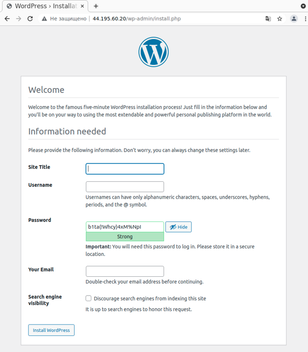

## AWS Terraform Wordpress module

Terraform module which create Wordpress on AWS using EC2 and RDS MySQL.

## What will be created

This is the list of resources that the module will create.

- EC2 instance (ubuntu-focal-20.04-amd64-server with ```instance_type = "t2.micro"```)
- bootstrap.sh.tmpl file for setup wordpress und setting up a configuration file for a database using variables for ```wp-config.php```
- RDS mysql instance (using ```random_password``` and ```instance_class = "db.t2.micro"```)
- Security Groups to access both EC2 (allow_http_ssh) and MYSQL (allow_mysql) 

## Usage

```hcl
provider "aws" {
  region  = "us-east-1"
}

module "wordpress" {
   source = "../wordpress-terraform-v2"

   vpc_id           = "vpc-af4a87d2"
   wordpress_subnet = "subnet-bd2c9ddb"
   rds_subnet       = ["subnet-bd2c9ddb", "subnet-3d9d221c"]
   rds_cidr         = ["172.31.0.0/16"]
}

output "wordpress_ip" {
    description = "Wordpress instance ID:"
    value       = module.wordpress.wordpress_ip
}

output "db_endpoint" {
    description = "DB instance MySQL endpoint:"
    value = module.wordpress.db_endpoint
}

output "db_name" {
    description = "Name of DB instance MySQL:"
    value = "db_wordpress"
}

output "db_username" {
    description = "DB instance MySQL username:"
    value = "admin"
}

output "db_password" {
    description = "DB instance MySQL sensitive password:"
    value = module.wordpress.db_password
    sensitive = true
}
```

Use the public ip address (output - ```wordpress_ip```) to run the WordPress installation. 

 

## Inputs

- VPC id
- Subnet id for EC2 Wordpress and at least two or more subnets for RDS MySQL
- CIDR blocks for RDS MySQL

## Outpusts

- Wordpress IP address
- DB Endpoint
- DB Name
- DB Username
- DB Password - You can show sensitive password using the command ```terraform output -json```